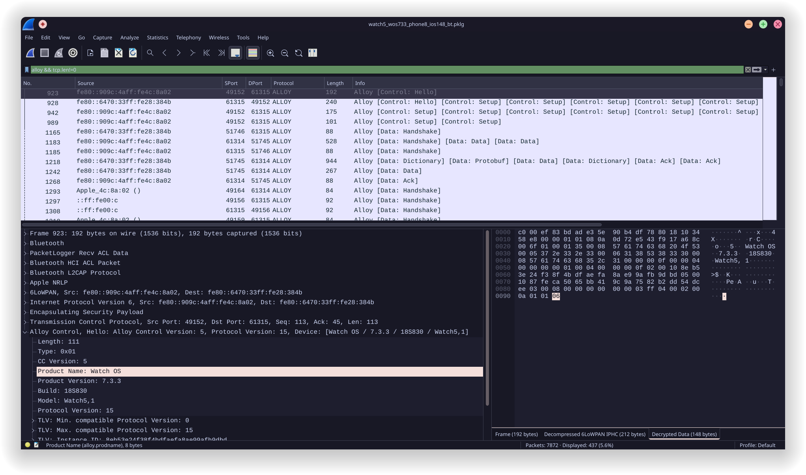

#  WatchWitch Wireshark Dissectors

This repository is a collection of various dissectors, scripts, and patches to assist in understanding the proprietary protocols of the Apple Watch used via Bluetooth and WiFi while utilizing the existing Wireshark ecosystem.	

  

## Structure
``doc/`` contains various documentation about this project\
``lua/`` contains the dissectors written in Lua\
``patches/`` contains patches to Wireshark required for certain functionality\
``scripts/`` contains extra tools to dump data from a capture

## Requirements
No extra dependencies are necessary for the Lua dissectors since Wireshark ships with a Lua interpreter. (tshark alone does not, you may need to install Lua manually in this case)\
The patches should work with any platform that you are able to compile Wireshark for.

## Installation
- Move the lua plugins into:\
  ``~/.local/lib/wireshark/plugins/`` (Linux/MacOS)\
  ``%APPDATA%/Wireshark/plugins/`` (Windows)\
  and reload with Ctrl + Shift + L
  
If your capture is in AES-GCM or you don't require ESP decryption then you can skip the following step.

- Installing a patched Wireshark for ChaCha20Poly1305-IIV decryption:\
  Follow the instructions in [doc/patches.md](doc/patches.md) for patching the needed functionality into Wireshark.
  
## Aquiring Bluetooth captures 
Follow the instructions in [doc/capture.md](doc/capture.md) for setting up PacketLogger and capturing Bluetooth data.

## Supported Protocols
- Magnet 
- NRLP
- SHOES
- NWSC
- Alloy Control/Data

Additionally there are stub dissectors for the following protocols
- BT.TS
- CLink

More information about each protocol can be found under [doc/protocols.md](doc/protocols.md).

## Limitations
- A patched Wireshark is necessary to get data beyond ESP because the IPSec dissector is missing support for the encryption standard preferred by the watch.
- Some commands are not or only partially implemented due to missing documentation.
- If the pairing/initialization part of the capture is missing then it is necessary to manually assign dissectors to the L2CAP channels/TCP ports.
- Some frames contain multiple payloads which can cause the tree view to become quite long due to reassembly.
- If the ESP packets are not dissected due to missing keys or an issue, some other heuristic dissectors that are shipped with Wireshark may try to mistakenly dissect the encrypted data. This could cause random crashes and is an issue with Wireshark itself! It is recommended to turn off unrelated protocols under ``Analyze -> Enabled Protocols``.

## References
- Nils Rollshausen, **WatchWitch: Investigating Apple Watch Interoperability and Security**, unpublished thesis, Master’s thesis, _Technical University of Darmstadt_, 2023.
- PyATV, **PyATV Documentation: Companion Link**, URL: https://pyatv.dev/documentation/protocols/#companion-link (visited on 08/29/2024)
